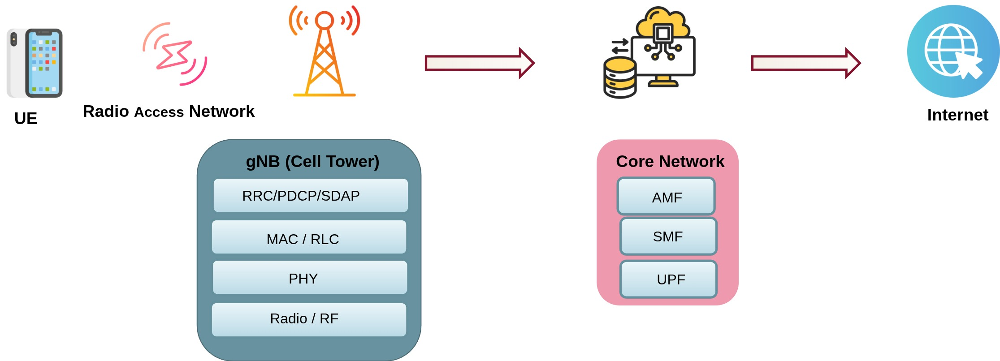
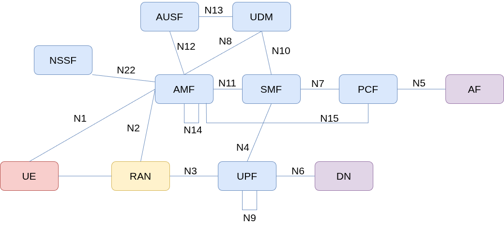
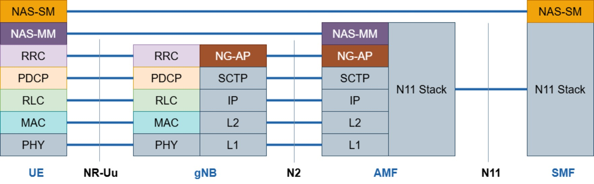
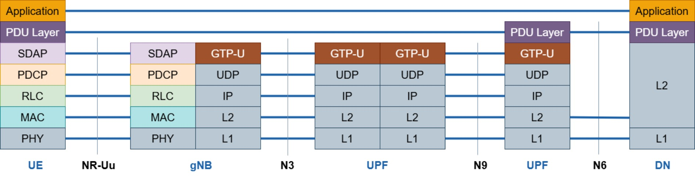
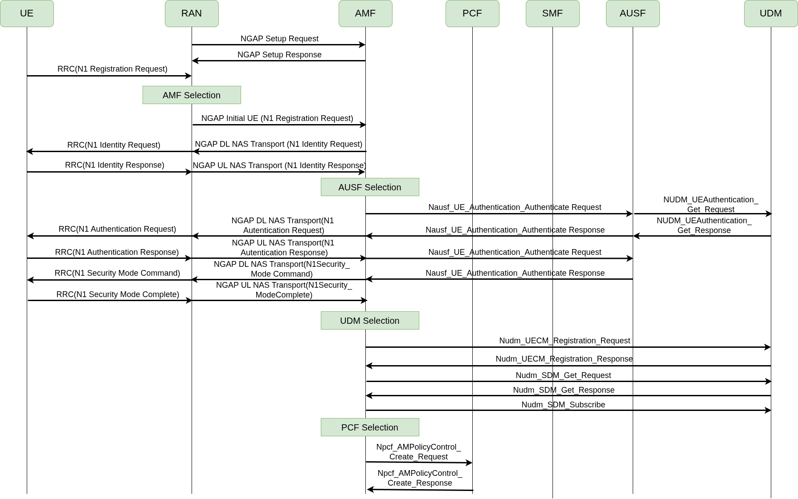

% 5G Core Network & OAI Hands-on
% OAI 5G NR Workshop — IIT Tirupati
% March 14, 2026 | Afternoon Session

<!-- ============================================================ -->
<!-- SECTION 0: WELCOME & GETTING STARTED                         -->
<!-- ============================================================ -->


## Afternoon Session — Agenda

| Block | Topic |
|-------|-------|
| **0** |   Setup: Clone repos and install utils |
| **1** |   5G Core Architecture & protocol stack |
| **2** |   Deploying OAI 5G core|
| **3** |   OAI deployment modes, building RAN, end-to-end 5G network|
| **4** |   Understanding what happened: NAS, Registration, Authentication |
| **5** |   Wireshark analysis & Configuration deep-dive |

**Goal:** By the end of this session, 

-  You will have a working end-to-end 5G network
-  Understand the initial protocol messages exchanged from UE power-on to internet access


## What You Need

- Laptop with **Ubuntu 22.04 or 24.04** (native or VM), Internet access


If you haven't set these up yet, lets setup.
 
### 1. Git
```
sudo apt-get update
sudo apt-get install git
```
### 2. Wireshark

❗ Make sure to select `yes` when the Wireshark installation asks you whether non-superusers should be able to capture packets.
Otherwise, you will have to run in sudo mode.

```
sudo add-apt-repository ppa:wireshark-dev/stable
sudo apt update
sudo apt install -y git net-tools wireshark
```

### 3. Networking
```
sudo apt install -y iperf3
```

## What You Need

### 4. Docker

```
sudo apt install -y apt-transport-https ca-certificates curl software-properties-common
curl -fsSL https://download.docker.com/linux/ubuntu/gpg | sudo apt-key add -
sudo add-apt-repository "deb [arch=amd64] https://download.docker.com/linux/ubuntu  $(lsb_release -cs)  stable"
sudo apt update
sudo apt install -y docker docker-ce
```

❗ Add your username to the docker group, otherwise you will have to run in sudo mode.

```
sudo usermod -a -G docker $(whoami)
```
❗ Now, close the terminal tab and re-open it.

-  If you dont have a docker account, create a docker account in [docker signup](https://www.docker.com/)
-  Login to docker

     ```bash
        docker login -u <username>
     ```
- Enter your password


<!-- ============================================================ -->
<!-- ACTION: Clone repositories                                    -->
<!-- ============================================================ -->

## Clone the Workshop Repository {.action}

```bash
# Clone the workshop repo
cd ~
git clone https://github.com/RajeevGa/iittp-oai-hands-on.git
cd iittp-oai-hands-on 
```

This repo contains configs, scripts, pcap traces, and these slides.


---

## 5G Architecture

<div class="diagram">
  
</div>

<!-- If image not ready, use this placeholder instead:
<div class="diagram-placeholder">
  <div class="placeholder-label">End-to-End 5G Architecture</div>
  <div class="placeholder-desc">UE → gNB (RAN) → 5G Core (AMF, SMF, UPF, ...) → Data Network / Internet</div>
</div>
-->

The 5G system has three main parts:

- **UE** — your phone or device
- **gNB** — the base station
- **5G Core** — the brain that manages connections, sessions, and data routing


<!-- ============================================================ -->
<!-- SECTION 1: 5G CORE ARCHITECTURE                              -->
<!-- ============================================================ -->


## 5G Core Network Architecture

<div style="display: flex; align-items: start; gap: 2em; margin-top: 0;">

<div style="flex: 1; margin: 0; padding: 0;">

- **5G core design choices**
  - Dividing monolithic element into smaller Network Functions (NFs)
  - Service-based architecture is based on a set of NFs
  - Virtualization
  - NFs communicate over a common bus via APIs.
  - Each NF registers with the NRF and can discover/consume services from other NFs dynamically


<small style="font-size: 0.55em; color: #666; line-height: 1.4;">

| NF | Full Name | What It Does |
|----|-----------|-------------|
| <span class="nf-label nf-amf">AMF</span> | Access & Mobility Management | Registration, authentication relay, mobility |
| <span class="nf-label nf-smf">SMF</span> | Session Management | PDU session setup, IP allocation, QoS |
| <span class="nf-label nf-upf">UPF</span> | User Plane Function | Packet routing, forwarding, data path |
| <span class="nf-label nf-ausf">AUSF</span> | Authentication Server | Handles 5G-AKA authentication |
| <span class="nf-label nf-udm">UDM</span> | Unified Data Management | Subscriber data, credentials |
| <span class="nf-label nf-nrf">NRF</span> | Network Repository Function | NF discovery — the "phonebook" |
| <span class="nf-label nf-nssf">NSSF</span> | Network Slice Selection | Selects the right network slice |
| <span class="nf-label nf-pcf">PCF</span> | Policy Control | Policy and charging rules |

</small>
</div>

<div style="flex: 1;">
  
</div>

</div>


## 5G Protocol Stack

<div style="display: flex; align-items: start; gap: 2em; margin-top: 0;">

<div style="flex: 1; margin: 0; padding: 0;">

- **Control Plane**
  - **Non-Access Stratum (NAS)**: Functional layer to exchange control plane messages between UE and CN
  - **Signaling** - Who is the user? Is she/he/it a valid one? where should the user data should go? How to handle Roaming?
  - Establishment and management of communication sessions (NAS-SM)
  - Mobility management (NAS-MM)
  - Example NAS messages:  UE attach and registration, authentication etc.
  - **AMF** handles control signaling with the UE and RAN
- **User  Plane**
  - Access Stratum (AS)
  - **SMF** programs the **UPF** 
  - **UPF** just forwards packets — it's told what to do by the SMF
  - Actual data packets Ex: YouTube video, Arattai
</div>

<div style="flex: 1;">
<div style="display: flex; flex-direction: column; align-items: center;">
  
  <p class="caption"><small>Control Plane</small></p>

  <p class="caption"><small>User Plane</small></p>
</div>

<small>
  **NR-Uu:** Radio interface (UE ↔ gNB)
  **N2:** gNB ↔ AMF — NGAP over SCTP
  **N11:** AMF ↔ SMF — HTTP/2 (Service-Based Interface)
</small>
</div>

</div>


## Installing OAI 5G Core {.action}

- Main repository  <https://gitlab.eurecom.fr/oai/cn5g>
- Each NF has its own repository. Example: <https://gitlab.eurecom.fr/oai/cn5g/oai-cn5g-amf>
  - *oai-cn5g-amf* is meant for AMF NF
  - All OAI 5G CN NFs are dockerized

## Clone the OAI RAN repository {.action}

Open a new terminal and clone the ran repository (tag: 2026.w10)

  ```bash
      git clone https://gitlab.eurecom.fr/oai/openairinterface5g.git
      cd ~/openairinterface5g
      git checkout 2026.w10
  ```

* The docker compose file and configuration files for `OAI 5G Core` is present in the following directory

     ```bash
         cd ~/openairinterface5g/doc/tutorial_resources/oai-cn5g
     ```
---

## Deploying OAI 5G core {.action}

- Now, pull the 5G core docker images
   
    ```bash
     docker compose pull
    ```
* start core network
   
    ```bash
     docker compose -f docker-compose.yaml up -d
    ```
* watch status of the core network

    ```bash
     watch docker compose -f docker-compose.yaml ps -a
    ```
All the docker containers should be `healthy`

- Important files: MySQL database stores the subscriber data,  yaml file is contains details of all NFs
- Some useful commands
  - docker ps -a
  - docker logs <container name> -f

## OpenAirInterface Operating Modes

<div style="display: flex; align-items: start; gap: 1em; margin-top: 0;">
<div style="flex: 1; margin: 0; padding: 0;">
- RFsimulator mode
  - No hardware and non real time
  - No over the air transmissions
  - Complete protocol stack except the RF part
  - Can induce channel models between gNB and nrUE
  - Learning, development and testing protocols
- RFsim is perfect for learning and protocol development because:
    - No hardware needed — runs on any laptop
    - Reproducible — no RF interference or hardware quirks
    - Fast iteration — change config, restart, test in seconds

**For this workshop:** We use rfsim so everyone can participate with just a laptop.

**In the lab:** We will also show a live over-the-air demo with real SDR hardware!

</div>

<div style="display: flex; flex-direction: column; align-items: center;">
  
</div>

</div>


## Installing OAI gNB & UE

compile the gNB and nrUE (tag: 2026.w10)

```bash
cd ~/openairinterface5g/
source oaienv
cd cmake_targets/
./build_oai -I # Only for first time build 
./build_oai -w SIMU --gNB --nrUE --ninja
```

---

## Launch gNB {.action}

```bash
cd ~/openairinterface5g/cmake_targets/ran_build/build
sudo ./nr-softmodem -O ~/iittp-oai-hands-on/ran/conf/gnb.sa.band78.fr1.106PRB.usrpb210.conf --gNBs.[0].min_rxtxtime 6 --rfsim --rfsimulator.[0].serveraddr server
```

**Watch for in the logs:**

```
[NGAP]   Send NGSetupRequest to AMF
[NGAP]   3584 -> 0000e000
[NGAP]   Served GUAMIs for AMF OAI-AMF (assoc_id=23):
[NGAP]    GUAMI:
[NGAP]      PLMN: MCC=001, MNC=01
[NGAP]      AMF Region ID: 1
[NGAP]      AMF Set ID: 1
[NGAP]      AMF Pointer: 1
[NGAP]   Supported PLMN 0: MCC=001 MNC=01
[NGAP]   Supported slice (PLMN 0): SST=0x01 SD=000
[NGAP]   Received NGSetupResponse from AMF
[UTIL]   threadCreate() for TASK_GTPV1_U: creating thread with affinity ffffffff, priority 50
[GNB_APP] [gNB 0] Received NGAP_REGISTER_GNB_CNF: associated AMF 1
```

This means gNB has successfully connected to the 5G Core!

---

## Launch nrUE {.action}

In another terminal:

```bash
cd ~/openairinterface5g/cmake_targets/ran_build/build
sudo ./nr-uesoftmodem -r 106 --numerology 1 --band 78 -C 3619200000 --ssb 516 --rfsim -O ~/iittp-oai-hands-on/ran/conf/nrue.conf
```

**Watch the logs for these milestones:**

```
[NR_RRC] State = NR_RRC_CONNECTED
[NR_RRC] RRCReconfiguration includes Measurement Configuration
[NR_RRC] Measurement gaps not yet supported!
[NAS]    [UE 0] Received NAS_CONN_ESTABLI_CNF: errCode 1, length 98
[NR_RRC] rrcReconfigurationComplete Encoded 10 bits (2 bytes)
[NR_RRC]  Logical Channel UL-DCCH (SRB1), Generating RRCReconfigurationComplete (bytes 2)
[NAS]    Received PDU Session Establishment Accept, UE IPv4: 10.0.0.2
[OIP]    TUN Interface oaitun_ue1 successfully configured, IPv4 10.0.0.2, IPv6 (null)
```

🎉 **Your UE is connected to the 5G network!**

---

## Verify End-to-End Connectivity {.observe}

**gNB logs — check for:**

```
[NR_RRC] [UL] (cellID bc614e, UE ID 1 RNTI 70af) Received RRCReconfigurationComplete
[NR_RRC] PDU Session Setup: ID=10, outgoing TEID=0x16461cbc, Addr=192.168.70.129
[NR_RRC] NGAP_PDUSESSION_SETUP_RESP: sending the message
[NGAP]   Encoded PDU Session Transfer (10): TEID=0x16461cbc, Addr=192.168.70.129
```

**nrUE — check interface is up:**

```bash
ifconfig oaitun_ue1
```

You should see an IP address like `10.0.0.x`

---

## Ping Test {.action}

In another terminal:

```bash
# From UE to the external data network container
ping -I oaitun_ue1 192.168.70.135

# From the container to the UE (downlink)
docker exec -it oai-ext-dn ping <UE IP address>
```

The IP address `192.168.70.135` is the IP address of the `oai-ext-dn` container.

---

## iperf Test {.action}

Start iperf3 server inside the external data network container:

```bash
docker exec -it oai-ext-dn bash
iperf3 -s
```

On the host in a new terminal, run iperf3 client bound to the UE IP:

```bash
# Downlink test
iperf3 -B <UE IP ADDRESS> -c 192.168.70.135 -u -b 50M -R

# Uplink test
iperf3 -B <UE IP ADDRESS> -c 192.168.70.135 -u -b 20M
```

🎉 **Congratulations — you have a working end-to-end 5G network!**

- Lets close UE and gNB applications (type ctrl+c in the terminals)
- Now let's understand what just happened under the hood...

<!-- ============================================================ -->
<!-- SECTION 3: UNDERSTANDING WHAT HAPPENED                       -->
<!-- ============================================================ -->

## What Just Happened? {.section-divider}

---

## The 5G Standalone Call Flow

<p align="center">

</p>
<br>
When you launched the nrUE, all these messages are exchanged, let's break it down!

---

## Key Configuration Files {.action}

Before we look at the signaling, let's understand some parameters you configured:

**5G Core:** `~/iittp-oai-hands-on/cn/conf/config.yaml`

**gNB:** `~/iittp-oai-hands-on/ran/conf/gnb.sa.band78.106prb.rfsim.conf`

**nrUE:** `~/iittp-oai-hands-on/ran/conf/nrue.conf`

## Connecting gNB and Core Network

- Before any UE can register, the gNB itself must first connect to the 5G Core.
- Happens through the **NGAP** (Next Generation Application Protocol) over the **N2 interface**.
- gNB establishes an SCTP transport connection to the AMF in the core network.
- 🤝 **NG Setup Request / Response**
     - The gNB sends an **NG Setup Request** 
     - The AMF replies with an **NG Setup Response** 
- ✅  Now the gNb is ready to serve UEs
- Lets see the configuration files to see the parameters
  - Core: `~/iittp-oai-hands-on/cn/conf/config.yaml`
  - gNB: `~/iittp-oai-hands-on/ran/conf/gnb.sa.band78.106prb.rfsim.conf`

## Steps in Connecting a UE
<div style="display: flex; align-items: start; gap: 1em; margin-top: 0;">
<div style="flex: 1; margin: 0; padding: 0;">
When you turn on your phone or enter a new coverage area, it needs to **register** with the network before it can make calls or use data. 

This happens in a few steps:

- 🙋  Registration Request
     - This is essentially the phone saying *"Hey, I'm here — let me in!"*
     - It includes the UE's identity so the network knows who is trying to connect.

- 🔐 Authentication
     - Verifying if its legitimate UE and network
-  🛡️ Security Mode & Registration Accept
    - Both sides trust each other
    - The network activates **encryption and integrity protection** on all future messages
</div>

<div style="display: flex; flex-direction: column; align-items: center;">
  
</div>

</div>


---

## UE Identifiers

Every phone has a few key identifiers — think of them as different types of ID cards:

- 🛂 **IMSI** — *International Mobile Subscriber Identity*
  - Tied to your **SIM card**. Uniquely identifies you as a subscriber.

- 📟 **IMEI** — *International Mobile Equipment Identity*
  - Tied to the **physical device**. Identifies the hardware, not the person.

- 📞 **MSISDN** — *Your phone number*

- 🏷️ **GUTI / 5G-GUTI** — *Temporary ID*
  - Assigned by the network after registration. Used instead of your real identity for privacy (like a visitor badge)

- An IMSI is a 15-digit number with three parts:

```
IMSI: 404 49 1234567890
       │   │  │
       │   │  └── MSIN: Mobile Subscriber Identification Number (9-10digits. your unique ID within the network)
       │   └───── MNC:  Mobile Network Code (49 = Airtel), 2-3 digits.
       └───────── MCC:  Mobile Country Code (404 = India) 
```


## 🔒 4G vs 5G: Privacy Improvement

 - In **4G (LTE)**, the IMSI is sent **in plain text** over the air during the initial attach. 
 - This is a known privacy risk — anyone with a radio receiver (like an IMSI catcher) can grab your identity.
 - In 5G, iInstead of sending the raw IMSI, the UE **encrypts** it into a value called **SUCI** (Subscription Concealed Identifier) before transmitting.
 - The network decrypts it on its side. 
 - This means even if someone intercepts the message, they only see a scrambled value — not your real identity.
 - Lets see the configuration files to see the parameters
   - Core: `~/iittp-oai-hands-on/cn/conf/config.yaml`
   - nrUE: `~/iittp-oai-hands-on/ran/conf/nrue.conf`


## Registration Flow 

```{.mermaid}
sequenceDiagram
    participant UE
    participant gNB
    participant AMF
    participant AUSF
    participant UDM

    Note over UE,gNB: Radio connection established (RRC)

    UE->>gNB: Registration Request (SUCI)
    gNB->>AMF: NGAP Initial UE Message (Registration Request)

    Note over AMF: AMF selects AUSF

    AMF->>AUSF: Authentication Request (SUCI)
    AUSF->>UDM: Get Auth Vectors (SUCI)
    UDM-->>AUSF: Auth Vector (RAND, AUTN, XRES*)
    AUSF-->>AMF: Auth Response (RAND, AUTN, HXRES*)

    AMF->>UE: Authentication Request (RAND, AUTN)
    UE-->>AMF: Authentication Response (RES*)

    Note over AMF: Compare HRES* with HXRES*
    AMF->>AUSF: Verify RES*
    Note over AUSF: Compare RES* with XRES*
    AUSF-->>AMF: Authentication Success

    AMF->>UE: Security Mode Command
    UE-->>AMF: Security Mode Complete

    AMF->>UE: Registration Accept (5G-GUTI)
    UE-->>AMF: Registration Complete
```


## Step 1: Registration Request

```
UE → gNB → AMF
```

- UE creates a **NAS Registration Request** containing its **SUCI**
- This NAS message is wrapped inside **RRC** (radio) and delivered to gNB
- gNB wraps it in **NGAP** (N2) and forwards to AMF
- AMF receives the SUCI and now needs to authenticate the UE

**Remember:** In RFsim mode, the radio part is simulated, but the NAS and NGAP messages are **real** — exactly what you'd see on a live network.

## Step 2: 5G-AKA Authentication

```{.mermaid}
sequenceDiagram
    participant UE
    participant AMF
    participant AUSF
    participant UDM

    Note over UDM: Has K, OP/OPc for this SUPI
    Note over UE: SIM has K, OP/OPc

    UDM->>UDM: Generate RAND, compute AUTN, XRES, XRES*
    UDM-->>AUSF: 5G HE Auth Vector (RAND, AUTN, XRES*)
    AUSF->>AUSF: Compute HXRES* from XRES*
    AUSF-->>AMF: 5G SE Auth Vector (RAND, AUTN, HXRES*)
    AMF-->>UE: Auth Request (RAND, AUTN)
    UE->>UE: Verify AUTN (check MAC), compute RES*
    UE-->>AMF: Auth Response (RES*)
    AMF->>AMF: Compute HRES*, compare with HXRES*
    AMF->>AUSF: Verify (RES*)
    AUSF->>AUSF: Compare RES* with XRES*
    AUSF-->>AMF: Success + Kseaf
```

- <strong>Mutual authentication:</strong> The UE verifies the network (via AUTN) AND
the network verifies the UE (via RES*)
- **Pre-shared secrets:** Both UE (SIM) and UDM know **K** (secret key) and **OP/OPc**
- These are the `key` and `opc` fields in your `nrue.conf` and the CN database!

## Step 3: Security Mode & Registration Accept

After successful authentication:

1. **AMF → UE: Security Mode Command**
   - Tells UE which encryption and integrity algorithms to use
   - From this point, all NAS messages are encrypted

2. **UE → AMF: Security Mode Complete**
   - UE confirms it can encrypt/decrypt

3. **AMF → UE: Registration Accept**
   - AMF assigns a **5G-GUTI** (temporary ID)
   - UE is now registered on the network

4. **UE → AMF: Registration Complete**

After this, the UE has a signaling connection. The network then sets up a **PDU Session** to create the data path — that's how your UE got the IP address and could ping. We'll cover PDU sessions in detail tomorrow.


<!-- ============================================================ -->
<!-- SECTION 4: WIRESHARK ANALYSIS                                -->
<!-- ============================================================ -->

## Wireshark Analysis {.section-divider}


## Capture Traces {.action}

Let's capture the signaling. Stop your gNB and UE if running, then:

```bash
# Start tcpdump to capture on the CN bridge interface
sudo tcpdump -i oai-cn5g -w monolithic.pcap
```

Now restart the gNB and UE (same commands as before). Let the UE connect fully, do a ping, then stop tcpdump with `Ctrl+C`.

Open the capture:

```bash
wireshark monolithic.pcap &
```

**Display filter:**

```
ngap || nas-5gs || pfcp || gtp
```

## Find the Registration Messages {.observe}

In Wireshark, you should see these messages. 
Find and analyze each one.

|  |  | |  |
|---|-----------|---------|-----------------|
| 1 | gNB → AMF | **NGAP: InitialUEMessage** | Contains NAS Registration Request with SUCI |
| 2 | AMF → gNB → UE | **NAS: Authentication Request** | Contains RAND and AUTN |
| 3 | UE → gNB → AMF | **NAS: Authentication Response** | Contains RES* |
| 4 | AMF → UE | **NAS: Security Mode Command** | Encryption algorithm selected |
| 5 | UE → AMF | **NAS: Security Mode Complete** | |
| 6 | AMF → UE | **NAS: Registration Accept** | Contains the assigned 5G-GUTI |

**Click on each message** and expand the NAS layer to see the actual field values.

## Discuss: What Did You See? {.discuss}

Let's compare what Wireshark shows with the theory:

1. **Find the SUCI** in the Registration Request — can you see the MCC/MNC? Is the MSIN in clear text or concealed? Compare with your `nrue.conf`

2. **Find RAND and AUTN** in the Authentication Request — these are the challenge from the network

3. **Find RES*** in the Authentication Response — this is the UE's proof of identity

4. **After Security Mode Command** — are subsequent NAS messages encrypted? How can you tell?

5. **Find the 5G-GUTI** in the Registration Accept — this is the temporary ID the UE will use from now on

## Experiment: What if the UE is Unknown? {.action}

Let's see what happens when authentication fails:

1. **Change the SUPI** in `nrue.conf` to a value not in the CN database
2. Restart the nrUE
3. Watch the AMF logs:
   ```bash
   docker logs oai-amf -f
   ```
4. Check Wireshark — do you see a Registration Reject?

**Try also:** Change the `key` or `opc` in `nrue.conf` (keep SUPI correct). What happens now? The UE is known but authentication fails — different error!

## Most Common Errors

| Error | Cause |  Check |
|-------|-------|---------------|
| NGAP Setup Failure | MCC/MNC mismatch between gNB and CN | gNB config vs CN config.yaml |
| Unidentified/Illegal UE | SUPI not in CN database | CN database (oai_db.sql) |
| Authentication Failure | Key or OPc mismatch | nrue.conf vs CN database |
| PDU Session Reject | DNN or SST mismatch | nrue.conf vs CN config |

- **Debug tools:** 
  - Wireshark traces
  -  `docker logs oai-amf -f`
<!-- ============================================================ -->
<!-- SECTION 5: WRAP-UP                                           -->
<!-- ============================================================ -->

## Summary {.section-divider}


## What We Covered Today

**Deployed a 5G Network**

- OAI 5G Core (docker) + gNB + nrUE in rfsim mode
- End-to-end connectivity: ping and iperf

**Understood What Happened**

- 5G Core architecture: SBA, NFs, what each does
- UE identifiers: SUPI, SUCI, 5G-GUTI
- Registration and 5G-AKA authentication flow
- Analyzed real signaling messages in Wireshark
- Mapped config file parameters to protocol messages


## What's Coming Tomorrow — Day 2

**PDU Session & Data Plane (picking up where we left)**

- How the UE gets its IP address (PDU session establishment)
- PFCP: how SMF programs the UPF
- GTP-U tunneling: how your data actually flows
- QoS flows, 5QI, DRB mapping

**5G NR Radio Access Network**

- Physical layer: OFDM, numerology, resource grid
- Channels: PDSCH, PUSCH, PDCCH, PUCCH, PRACH
- MAC scheduling, CQI, MCS
- RAN hands-on with OAI

## Keep Your Setup Running! {.action}

For tomorrow, you'll need the same environment.

```bash
# To gracefully stop today's session:

 1. Stop nrUE: Ctrl+C in the nrUE terminal
 2. Stop gNB: Ctrl+C in the gNB terminal
 3. Stop CN: 
     cd ~/iittp-oai-hands-on/cn
     docker compose down    # stop
```

**Don't delete** the OAI build — we'll use the same binaries tomorrow!


## Thank You!


**OAI Resources:**

- OAI RAN: `https://gitlab.eurecom.fr/oai/openairinterface5g`
- OAI CN5G: `https://gitlab.eurecom.fr/oai/cn5g/oai-cn5g`
- OAI Documentation: `https://openairinterface.org/`

**Questions?**

See you tomorrow for the data plane & RAN deep dive!

