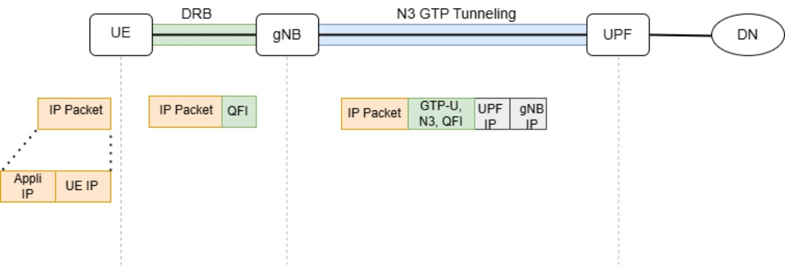
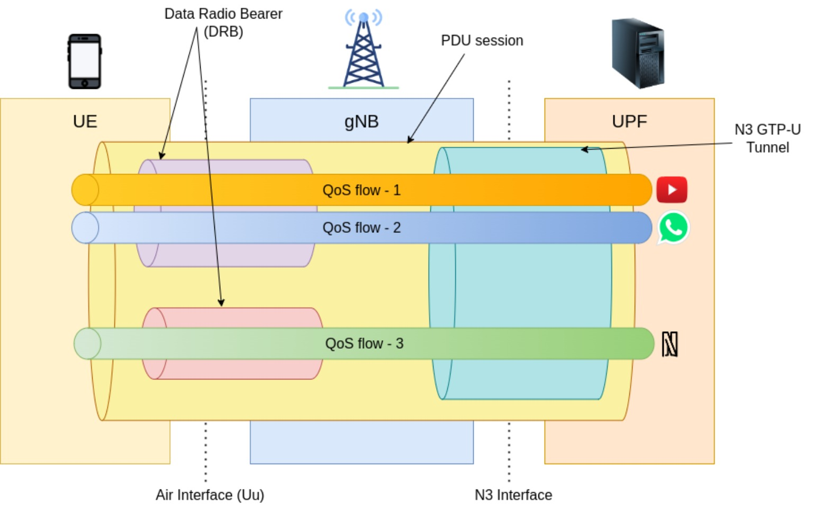
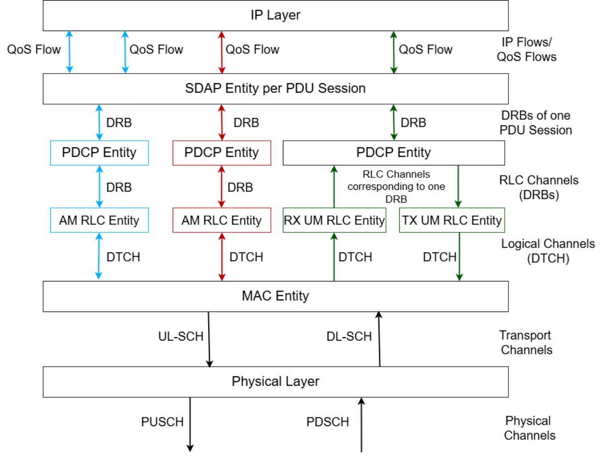
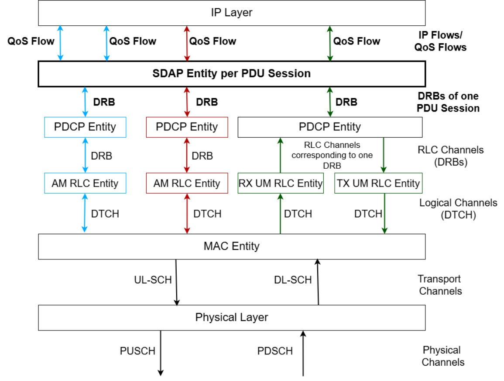
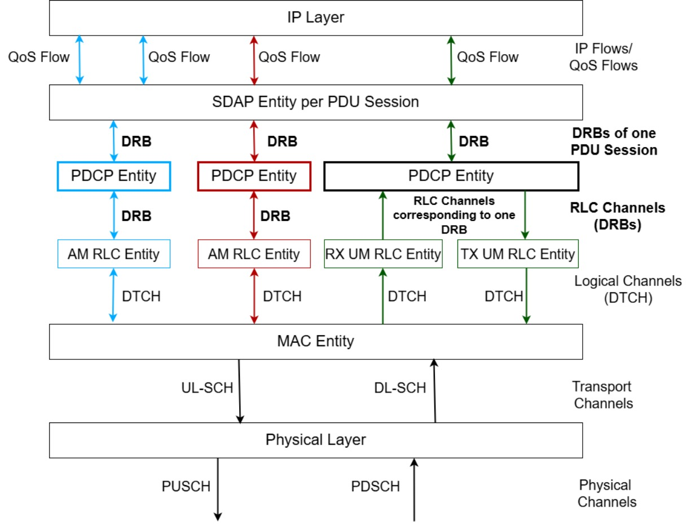
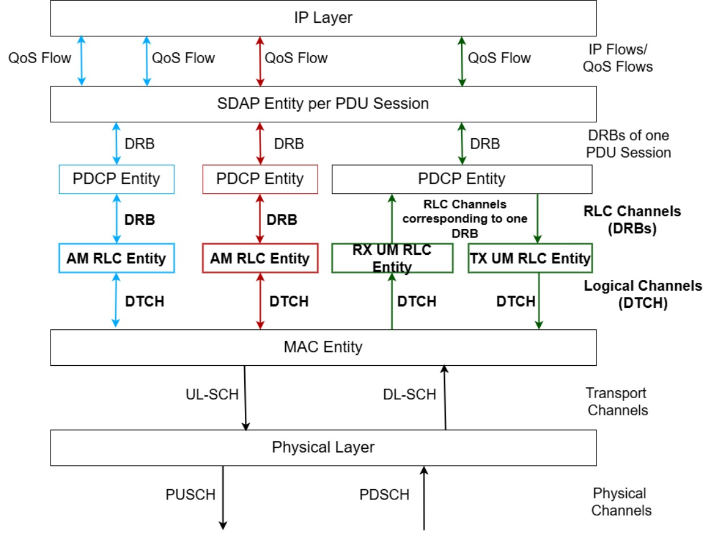
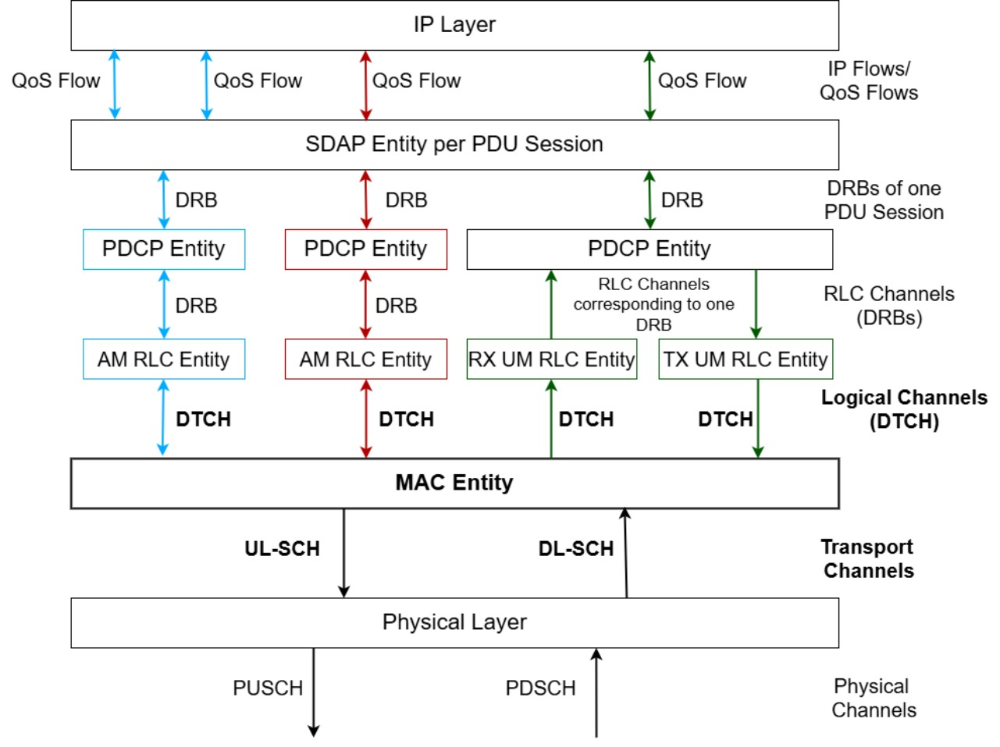

% 5G Data Plane & RAN Hands-on
% OAI 5G NR Workshop — IIT Tirupati
% March 15, 2026 | Day 2


## Quick Recap — Day 1

- Deployed OAI 5G Core (docker) + gNB + nrUE in rfsim
- Got an IP address to UE, ping, ran iperf
- Understood registration and authentication procedures
- Analyzed messages in Wireshark
- **Things we skipped:** 
  - How did the UE actually get its IP address? 
  - How does your ping packet travel from UE to the core?
  - How do UE and gNB (cell tower) communicate over the air?

## Day 2 — Agenda

| Session | Topic |
|---------|-------|
| **Morning I** | PDU Session & Data Plane|
| **Morning I** | RAN Protocol Stack|
| **Morning II** | RAN Hands-on — experiments, scope visualizatio |
| **Afternoon** | RAN Hands-on, and advanced topics |

## 5G Protocol Stack

<div style="display: flex; align-items: start; gap: 2em; margin-top: 0;">

<div style="flex: 1; margin: 0; padding: 0;">

- **Control Plane**
  - Non-Access Stratum (NAS): Functional layer to exchange control plane messages between UE and CN
  - **Signaling** - Who is the user? Is she/he/it a valid one? where should the user data should go? How to handle Roaming?
  - **Establishment and management of communication sessions (NAS-SM)**
- **User Plan Function (UPF)**
  - **SMF** programs the **UPF**
  - Packet routing and forwarding
  -  Packet inspection and user-plane part of policy rule enforcement
  - QoS handling for user plane (packet filtering, UL/DL rate enforcement)
</div>

<div style="flex: 1;">
  

  
  <p class="caption"></small> End-to-end 5G system — UE connects through RAN to Core Network and onward to the Internet </small></p>

</div>

</div>

<!-- ============================================================ -->
<!-- SESSION 1: PDU SESSION & DATA PLANE                          -->
<!-- ============================================================ -->

## PDU Session


**Packet Data Unit (PDU) Session** — a data pipe from UE to the internet.

<div class="key-concept">
<strong>PDU Session =</strong> An end-to-end data path with:
<ul>
  <li>An <strong>IP address</strong> for the UE (that's the 10.0.0.x you saw!)</li>
  <li><strong>QoS rules</strong> defining how traffic is handled</li>
  <li>A <strong>DNN</strong> (Data Network Name) — configured in your ue.conf</li>
</ul>
</div>


## PDU Session Setup — What Happened After Registration

```{.mermaid}
sequenceDiagram
    participant UE
    participant gNB
    participant AMF
    participant SMF
    participant UPF

    UE->>AMF: PDU Session Establishment Request (NAS-SM)
    Note over AMF: AMF selects SMF

    AMF->>SMF: Nsmf_PDUSession_CreateSMContext
    SMF->>UPF: PFCP Session Establishment (PDR, FAR, QER)
    UPF-->>SMF: PFCP Session Establishment Response

    SMF-->>AMF: N1N2 Message Transfer
    AMF->>gNB: NGAP PDU Session Resource Setup Request
    Note over gNB: gNB allocates radio resources (DRB)
    gNB->>UE: RRC Reconfiguration (PDU Session Accept)
    UE-->>gNB: RRC Reconfiguration Complete

    gNB-->>AMF: NGAP PDU Session Resource Setup Response
    AMF->>SMF: Update SM Context
    SMF->>UPF: PFCP Session Modification

    Note over UE,UPF: Data path ready!
```

---

## GTP-U — Your Packet Inside a Tunnel

When you ping from UE, the packet travels like this:

<div class="diagram">
  
</div>

</small>

- UE Ip packet is 
   - Tagged with QoS Flow Identifier (QFI)
   - Tunneled with GTP-U (GPRS Tunneling Protocol – User Plane)
   - Transparent to RAN
</small>

---


## Find PDU Session & GTP-U in Wireshark {.action}

Restart your network if needed. Start capture:

```bash
sudo tcpdump -i oai-cn5g -w day2.pcap
```

Launch gNB, UE, do a few pings, then stop tcpdump.

```bash
wireshark day2.pcap &
```

**Find these messages:**

| # | Protocol | Message | What to Look For |
|---|----------|---------|------------|
| 1 | PFCP | **Session Establishment Request** | PDR and FAR rules from SMF to UPF |
| 2 | PFCP | **Session Establishment Response** | UPF confirms |
| 3 | NGAP | **PDU Session Resource Setup** | QoS info, tunnel info |
| 4 | GTP-U | **G-PDU** | Your ping packet inside the tunnel! |

---

## Observe GTP-U Packets {.observe}

Filter for GTP:

```
gtp
```

Click on a GTP-U packet and expand:

1. **Outer IP header:** gNB IP ↔ UPF IP
2. **UDP header:** Port 2152
3. **GTP-U header:** TEID value
4. **Inner IP header:** UE IP ↔ ping target

**This is the tunnel!** Your ping is wrapped inside GTP-U between gNB and UPF.


## User Plane RAN Protocol Stack
<div style="display: flex; align-items: start; gap: 2em;">
<div style="flex: 1;">
  
</div>
<div style="flex: 1;">
  
 - Quality of Service (QoS)
   - Guaranteed bit rate (GBR) and non-GBR
</div>
</div>


## User Plane RAN Protocol Stack
<div style="display: flex; align-items: start; gap: 2em;">
<div style="flex: 1;">
  
</div>
<div style="flex: 1;">
  
</div>
</div>

## Analogy: Ordering on an e-commerce platform

<div style="display: flex; align-items: start; gap: 2em;">
<div style="flex: 1;">
  
</div>
<div style="flex: 1;">

- Think of an e-commerce platform as your 5G operator
- Once registered, you can order from various vendors
- Lets look at a hypothetical delivery system
  - **Alice and Bob** each order items with different urgency:
    - 🥬 **Fresh** — same-day, perishable
    - 💻 **Prime** — next-day, guaranteed
    - 🧹 **Normal** — whenever, best effort
- How an order turned into a delivery
  - Need to handle priorities
  - Dispatch hub should tackle how many delivery resources are available
  - Can an order fit in one delivery?
  - Do we need a small or bif vechcle for this delivery?
</div>
</div>


## Service Data Adaptation Protocol (SDAP)

<div style="display: flex; align-items: start; gap: 2em; margin-top: 0;">

<div style="flex: 1; margin: 0; padding: 0;">
  

- **Maps QoS flows to Data Radio Bearers** [3GPP TS 37.324]
- Each IP flow gets a Qos Flow Identification (QFI) — defines treatment
- SDAP groups similar QFI flows into a **DRB**
- Marks QFI in UL and DL packets
- Multiple QoS flows can share one DRB if they need similar treatment.
- One SDAP entity per PDU session
</div>

<div style="flex: 1;">
  
</div>

</div>

## Analogy

<div style="display: flex; align-items: start; gap: 2em;">
<div style="flex: 1;">
  
</div>
<div style="flex: 1;">

- Quality of service -- Item with deliver tier (Fresh 🥬, Priority customer)   
- SDAP DRB grouping --  Group sharing same tier (🍎, 🥭, 🥛 => Fresh )
- 🧹 Normal items — Whenever resources are available (best effort)
</div>
</div>


## Packet Data Convergence Protocol (PDCP)

<div style="display: flex; align-items: start; gap: 2em;">
<div style="flex: 1;">
  
</div>
<div style="flex: 1;">

- **Security and reliability** [3GPP TS 38.323]
- Ciphering — encrypts data (keys from Day 1 authentication!)
- Integrity protection — detects tampering
- Sequence numbering — every PDCP packet is numbered
- Duplicate discarding
- In-order delivery during handover
- Header compression (ROHC)
- One PDCP entity per DRB

</div>
</div>


## Radio link contro (RLC) 

<div style="display: flex; align-items: start; gap: 2em;">
<div style="flex: 1;">
  
</div>
<div style="flex: 1;">

- **Segmentation and reliable delivery** [3GPP TS 38.322]
- Segmentation — split large RLC packets to small ones that can be transported by lower layers 
- Reassembly at receiver
- Sequence numbering
- **ARQ** — retransmit lost segments (AM mode)
- One RLC entity per DRB
- RLC channel ↔ Logical channel
</small>

| Mode | Behavior | Use Case |
|------|----------|----------|
| **AM** (Acknowledged) | Numbered, confirmed, retransmitted | Web, file download |
| **UM** (Unacknowledged) | Numbered, no retransmission | Voice, video |
| **TM** (Transparent) | Pass-through | Broadcast, paging |
</small>

</div>
</div>


## MAC 

<div style="display: flex; align-items: start; gap: 2em;">
<div style="flex: 1;">
  
</div>
<div style="flex: 1;">

- Scheduling and Transport Block (TB) construction **[3GPP TS 38.321]**
- Multiplexing — logical channels → Transport Block
- Scheduling — which UE, how many resoursess, at which rate?
- HARQ — Error correction at TB level 
- Timing and power control loops

</div>
</div>

## MAC — Scheduling

:::::::::::::: {.columns}
::: {.column width="50%"}

:::
::: {.column width="50%"}

The scheduler runs **every slot** and decides:

- **Which PRBs?** (frequency resources)
- **Which MCS?** (based on CQI feedback)
- **How much data?** (based on BSR)

**Inputs:** RLC buffers, CQI, HARQ status, QoS

**Algorithms:**

| | Rule |
|---|------|
| **Round Robin** | Equal turns |
| **Max Throughput** | Best channel first |
| **Proportional Fair** | Best relative channel |

:::
::::::::::::::

---

## MAC — HARQ

If a TB has errors → receiver sends **NACK** → transmitter retransmits.

5G uses **Incremental Redundancy HARQ**:

- First TX sends coded bits (RV0)
- Retransmission sends **different** bits (RV2, RV3, RV1)
- Receiver **combines** all attempts

Faster than RLC retransmission. Operates at TB level, within a few ms.

## Analogy

<div style="display: flex; align-items: start; gap: 2em;">
<div style="flex: 1;">
  
</div>
<div style="flex: 1;">
- Construct a delivery parcel per user
  - **Parcel 1:** 🥬 Fresh + 💻 Prime → 🚛 truck
  - **Parcel 2:** 🧹 Normal → 🏍️  bike (later)
- Assign a vehicle and route
  - Good road → 🚛 truck (big parcel)
  - Congested → 🏍️  bike (small parcel)
- One order may need multiple parcels across multiple delivery slots
- Dispatch algorithm based on
  - Number of orders and Order sizes
  - Traffic conditions and road reports
  - Delivery person availability
</div>
</div>


## PHY — Physical Layer {.section-divider}

---

## PHY — What It Does

:::::::::::::: {.columns}
::: {.column width="50%"}

:::
::: {.column width="50%"}

Bits become radio waves:

- **OFDM** — data across many subcarriers
- **Modulation** — QPSK, 16QAM, 64QAM, 256QAM
- **Channel coding** — LDPC (data), Polar (control)
- **MIMO** — multiple antennas
- **Channel estimation** — constant measurement

**Resource Grid:** frequency (RBs) × time (slots)

One **Resource Element** = 1 subcarrier × 1 OFDM symbol

:::
::::::::::::::

---

## PHY — Physical Channels

| Channel | Direction | What it carries |
|---------|-----------|----------------|
| **PDSCH** | Downlink | User data + system info |
| **PUSCH** | Uplink | User data + control info |
| **PDCCH** | Downlink | Scheduling decisions (DCI) |
| **PUCCH** | Uplink | CQI, HARQ ACK/NACK |
| **PRACH** | Uplink | Random access preamble |
| **PBCH** | Downlink | Master Information Block |


## OAI Code Pointers

| Layer | OAI Source Path |
|-------|----------------|
| **SDAP** | `openair2/SDAP/nr_sdap/` |
| **PDCP** | `openair2/LAYER2/nr_pdcp/` |
| **RLC** | `openair2/LAYER2/nr_rlc/` |
| **MAC** | `openair2/LAYER2/NR_MAC_gNB/gNB_scheduler.c` |
| **PHY RX & TX** | `openair1/SCHED_NR/phy_procedures_nr_gNB.c` |


<!-- ============================================================ -->
<!-- SESSION 3: RAN HANDS-ON                                      -->
<!-- ============================================================ -->

## RAN Hands-on {.section-divider}

---

## OAI Scope — See Your Signal Live

| Tool | How to build | How to use |
|------|-------------|------------|
| **nrscope** | Built automatically | Run with `-d` flag |
| **nrqtscope** | `./build_oai --build-lib nrqtscope --ninja` | Run with `-d --XFORMS` |

What you can see:

- Constellation diagrams (PDSCH, PUSCH, PBCH)
- Channel frequency response
- Time domain signal energy
- LLR graphs

---

## Launch with Scope {.action}

```bash
# gNB with scope
cd ~/openairinterface5g/cmake_targets/ran_build/build
sudo -E ./nr-softmodem --rfsim \
  -O ~/iittp-oai-hands-on/ran/conf/gnb.sa.band78.106prb.rfsim.conf \
  -d
```

```bash
# UE with scope
sudo -E ./nr-uesoftmodem -r 106 --numerology 1 --band 78 \
  -C 3619200000 --rfsim --ssb 516 \
  -O ~/iittp-oai-hands-on/ran/conf/ue.conf \
  -d
```

❗ Remote VM? Use **X11 forwarding**: `ssh -X user@host`

---

## gNB Scope {.observe}

:::::::::::::: {.columns}
::: {.column width="50%"}

:::
::: {.column width="50%"}

- **PUSCH constellation** — tight clusters = good signal
- **Channel frequency response** — across subcarriers
- **Time domain** — energy over time

**Try:** Run `iperf3` uplink while watching!

:::
::::::::::::::

---

## UE Scope {.observe}

:::::::::::::: {.columns}
::: {.column width="50%"}

:::
::: {.column width="50%"}

- **PDSCH constellation** — QPSK=4pts, 16QAM=16, 64QAM=64
- **PBCH constellation** — always QPSK
- **Channel estimates** — frequency domain

**Try:** Run `iperf3` downlink — watch constellation get denser!

:::
::::::::::::::

---

## Channel Model with RFsim {.action}

Add to gNB config:

```
@include "channelmod_rfsimu.conf"
```

Launch UE with channel model:

```bash
sudo -E ./nr-uesoftmodem -r 106 --numerology 1 --band 78 \
  -C 3619200000 --rfsim --ssb 516 \
  -O ~/iittp-oai-hands-on/ran/conf/ue.conf \
  -d --rfsimulator.options chanmod
```

**Watch:** Constellations spread out with noise and fading.

---

## Experiment 1: Different Modulations (phy-test) {.action}

```bash
# gNB in phy-test mode
sudo -E ./nr-softmodem --rfsim \
  -O ~/iittp-oai-hands-on/ran/conf/gnb.sa.band78.106prb.rfsim.conf \
  --phy-test -d

# UE in phy-test mode
sudo -E ./nr-uesoftmodem -r 106 --numerology 1 --band 78 \
  -C 3619200000 --rfsim --phy-test --nokrnmod 1 -d
```

**Exercise:** Change MCS in scope:

- MCS 4 → QPSK → 4 points
- MCS 15 → 16QAM → 16 points
- MCS 25 → 64QAM → 64 points

---

## Experiment 2: TDD Pattern {.action}

**5ms pattern (default):**

```
dl_UL_TransmissionPeriodicity  = 6;   # 5ms
nrofDownlinkSlots              = 7;
nrofDownlinkSymbols            = 6;
nrofUplinkSlots                = 2;
nrofUplinkSymbols              = 4;
```

**2.5ms pattern:**

```
dl_UL_TransmissionPeriodicity  = 5;   # 2.5ms
nrofDownlinkSlots              = 2;
nrofDownlinkSymbols            = 6;
nrofUplinkSlots                = 2;
nrofUplinkSymbols              = 4;
```

**Exercise:** Run iperf DL+UL with both. Which gives better UL throughput? Why?

---

## Experiment 3: Bandwidth {.action}

**20 MHz (51 PRBs):**

```bash
sudo -E ./nr-softmodem --rfsim \
  -O ~/iittp-oai-hands-on/ran/conf/gnb.sa.band78.51prb.rfsim.conf

sudo -E ./nr-uesoftmodem -r 51 --numerology 1 --band 78 \
  -C 3609300000 --rfsim --ssb 228 \
  -O ~/iittp-oai-hands-on/ran/conf/ue.conf
```

**100 MHz (273 PRBs):**

```bash
sudo -E ./nr-softmodem --rfsim \
  -O ~/iittp-oai-hands-on/ran/conf/gnb.sa.band78.273prb.rfsim.conf

sudo -E ./nr-uesoftmodem -r 273 --numerology 1 --band 78 \
  -C 3649260000 --rfsim --ssb 516 \
  -O ~/iittp-oai-hands-on/ran/conf/ue.conf
```

**Exercise:** Compare throughput at 20MHz vs 40MHz vs 100MHz.

---

## Experiment 4: Multiple UEs {.action}

```bash
# gNB
sudo -E ./nr-softmodem --rfsim \
  -O ~/iittp-oai-hands-on/ran/conf/gnb.sa.band78.106prb.rfsim.conf

# UE1
sudo ~/iittp-oai-hands-on/ran/multi-ue.sh -c1 -e
sudo -E ./nr-uesoftmodem -r 106 --numerology 1 --band 78 \
  -C 3619200000 --rfsim \
  -O ~/iittp-oai-hands-on/ran/conf/ue1.conf \
  --rfsimulator.serveraddr 10.201.1.100

# UE2
sudo ~/iittp-oai-hands-on/ran/multi-ue.sh -c2 -e
sudo -E ./nr-uesoftmodem -r 106 --numerology 1 --band 78 \
  -C 3619200000 --rfsim \
  -O ~/iittp-oai-hands-on/ran/conf/ue2.conf \
  --rfsimulator.serveraddr 10.202.1.100
```

---

## Multiple UEs — Testing {.action}

```bash
# UE1
sudo ip netns exec ue1 bash
ping -I oaitun_ue1 192.168.70.135

# UE2
sudo ip netns exec ue2 bash
ping -I oaitun_ue1 192.168.70.135
```

**Exercise:** Run iperf from both UEs simultaneously. Watch the scheduler sharing resources.

```bash
# Cleanup
sudo ~/iittp-oai-hands-on/ran/multi-ue.sh -d1 -d2
```

<!-- ============================================================ -->
<!-- WRAP-UP                                                      -->
<!-- ============================================================ -->

## Workshop Summary {.section-divider}

---

## What We Covered

**Day 1 — Core Network & Control Plane**

- 5G Core architecture: SBA, Network Functions
- Deployed OAI CN + gNB + UE in rfsim
- NAS registration and 5G-AKA authentication
- Wireshark analysis

**Day 2 — Data Plane & RAN**

- PDU session establishment and PFCP
- GTP-U tunneling
- RAN protocol stack: SDAP → PDCP → RLC → MAC → PHY
- OAI scope visualization
- Experiments: TDD, bandwidth, multi-UE

---

## Where to Go From Here

- Over-the-air with real SDR hardware (USRP, AW2S)
- CU-DU split (F1 interface)
- FlexRIC for O-RAN xApps
- Contribute to OAI open source!

**Resources:**

- OAI RAN: `https://gitlab.eurecom.fr/oai/openairinterface5g`
- OAI CN5G: `https://gitlab.eurecom.fr/oai/cn5g/oai-cn5g`
- 3GPP Specs: TS 23.501, TS 38.300, TS 38.321

---

## Thank You!

**Instructors:** Rajeev Gangula, Rakesh Mundlamuri, Venkatareddy Akumalla, Chandra R. Murthy, Subash Mondal

**Workshop materials:** `https://github.com/RajeevGa/iittp-oai-hands-on`

**Feedback is welcome!**
